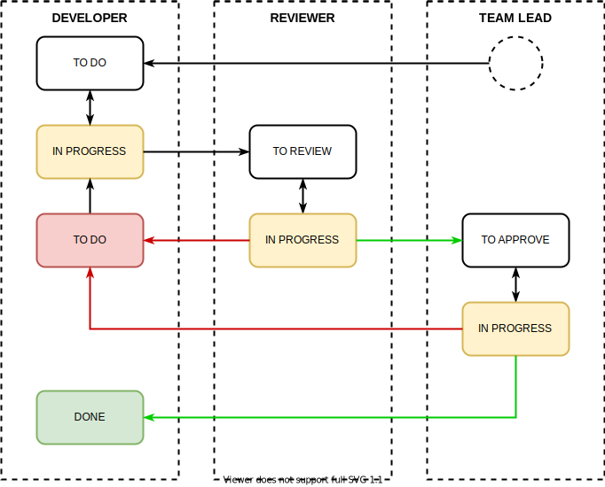

= practice-jd2-86

Dashboard for Project: https://github.com/orgs/JD2-86/projects/1

== Terminologies

* *Issue* - задача поставленная разработчику на выполнение. Иногда применяют и другие термины, например: *ticket*, *task*, *case*, *задача* и т.д.
* *Dashboard* - структура в виде таблицы, на которой отображаются все *issues* и соответствующее им состояние. Так же могут использоваться различные:
** *filters* - позволяют отображать только нужные *issues*
** *fields* - содержат дополнительную информацию, например: кто сейчас занимается задачей
* *Workflow* - это цепочка состояние (фактически работ) через которые проходит каждая *issue* в рамках данного проекта.

== Workflow

* Одному занятию (т.е. практике и домашней работе) соответствует один *issue*.
* При работе над *issue*, она ДОЛЖНА находится в АКТУАЛЬНОМ состоянии на *dashboard*.
* Для управления выполнение работ на проекте будет использовать следующий workflow:

=== Git flow: feature-branch

* `master` - master-branch, т.е. branch, код в который попадает ТОЛЬКО после ОБЯЗАТЕЛЬНОГО *code review*.
* `${lastname}-lesson${XX}` - feature-branch, т.е. branch, где выполняется практика и домашняя работа.

== Структура проекта

* Одна *workdir* (рабочая директория) для одного студента в корне проекта. В качестве имени директории использовать фамилию на английском в нижнем регистре.
* В *workdir* находятся директории под каждое занятие. В качестве названия использовать подход `lessonXX`, где `XX` - двухзначный номер занятия. Например: `lesson01`, `lesson02` и т.д.
* В директории для занятия находятся две директории:
** `practice` - в ней находится задание, которое было дано в качестве практического
** `homework` - в ней находится задание, которое было дано в качестве работы на дом
* Структура директорий или проектов внутри директорий `practice` и `homework` не регламентируется, но стоит придерживаться лучших практик именования и структурирования проектов.

.Пример структуры директорий
----
.
├── rakovets
│   ├── lesson01
│   │   ├── homework
│   │   │   └── calculator-app
│   │   └── practice
│   │       └── Task01.java
│   ├── lesson02
│   │   ├── homework
│   │   │   └── calculator-app-with-maven
│   │   │       ├── pom.xml
│   │   │       └── src
│   │   └── practice
│   │       └── Task01.java
│   └── lesson04
└── README.adoc
----
